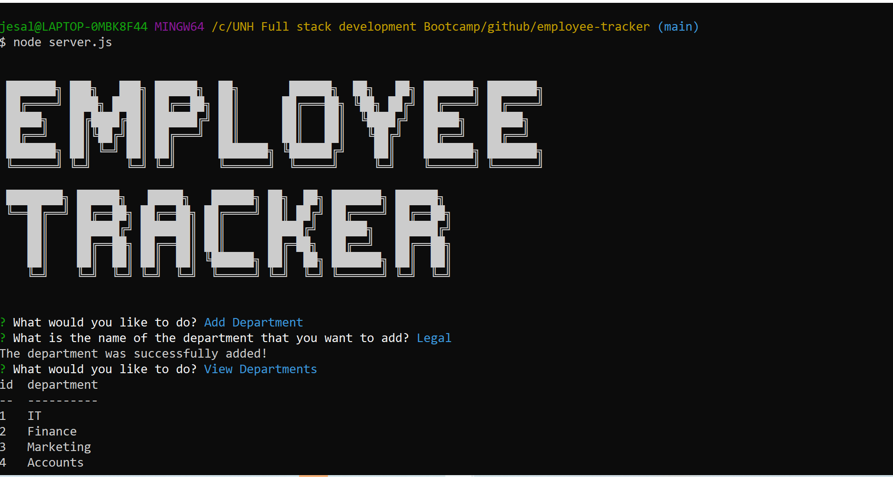
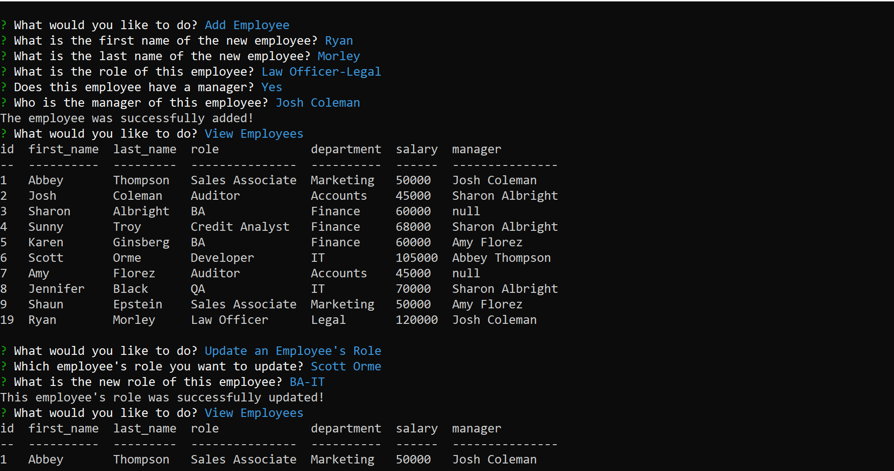

# employee-tracker
Employee tracker application built using node, inquirer and mySQL
[](https://opensource.org/licenses/MIT)

## User Story
```
As a business owner
I want to be able to view and manage the departments, roles, and employees in my company
So that I can organize and plan my business
```
## Description
Employee-tracker is a command line application built using the node, inquirer and mySQL. The application allows users to 
- add departments, roles and employees 
- view list of departments, roles and employees
- update an employee's manager
- update an employee's role
- delete departments, roles, employees
- view employees by manager 
This application is especially useful for business owners that need to keep track of the employees in their Company in order to organize and plan their business.

Application Development: 
Two different sql files have been created:
- schema.sql -  includes the database schema and tables created
- seed.sql - includes the insert statements to pre-populate the data in the database tables
The model folder includes 3 different files where class has been created each for department, role and employee for cleaner code and to avoid repetition
The employee_tracker.js file houses all the functions for performing specific SQL queries based on the feature/option user selects to do.

## Table of Contents
* [Installation](#installation)
* [Usage](#usage)
* [Contributing](#contributing)
* [Questions](#questions)
* [License](#license)

## Installation
1. Pre-requirement is to install a command-line application and node version 14.15.0 or higher.
2. Open the terminal/command-line and open the directory where the project is downloaded. 
3. Enter the command 'npm install' to install all the required package dependencies.

## Usage
1. In the command line/terminal within the directory that the project is downloaded, invoke the application using the command 'node server.js' 
2. The application name will be displayed followed by a question prompting the user to select what is it that he would like to do. Select an option from the multi-option list provided.
3. To add a department: Select Add Department option. Provide answers to the questions prompted, post which the newly created department will be added to the department list in the database.
4. To add a role: Select Add Role option. Provide answers to the questions prompted, post which the newly created role for the requested department will be added to the role table in the database.
5. To add an employee: Select Add Employee option. Provide answers to the questions prompted, post which the newly created employee for the requested department will be added to the employee table in the database.
6. To view departments: Select View Departments option. This will show all the fields of the department table that will include a list of all the existing departments in the database.
7. To view roles: Select View Roles option. This will show the fields of the role table that will include a list of all the existing roles in the database along with the corresponding department.
8. To view employees: Select View Employees option. This will show the fields of the employee table that will include a list of all the existing employees in the database.
9. To update an employee's role: Select Update an Employee's Role option. Provide answers to the questions prompted, post which the new role for the employee will be updated to the employee table in the database.
10. To update an employee's manager: Select Update an Employee's Manager option. Provide answers to the questions prompted, post which the new manager for the employee will be updated to the employee table in the database.
11. To view employees by manager: Select View Employees by Manager option. Provide an answer to the question prompted about which manager's employees you want to view. All the employees of that manager will be listed.
12. To delete a department : Select Delete Department option. This will allow the user to delete any of the existing departments including the corresponding roles and employees from the database.
13. To delete a role: Select Delete Role option. This will allow the user to delete any of the existing roles among with the corresponding employee in the database.
14. To delete an employee: Select Delete Employee option. This will allow the user to delete any of the existing employees in the database.
15. To quit the application: Select Exit option. The user will not be prompted with any further question and will quit the application.


## Contributing
This application has been individually developed by Jesal Mehta. If you are interested in fixing issues and contributing directly to the code base, you can do so according to the guidelines listed in the [Contributor Covenant](https://www.contributor-covenant.org/) industry standard.

## Questions
For any questions,
Here is my Github profile link: [JesalDM](https://github.com/JesalDM)  
You can also reach out to me directly at [jesaldmehta@gmail.com](mailto:jesaldmehta@gmail.com)

## License
This project is licensed under the terms of the MIT license.

## For Review
* Github Repository URL: https://github.com/JesalDM/employee-tracker
* Walkthrough video: 
* Screenshot : 
    - 
    - 